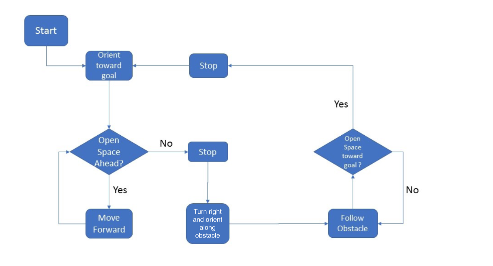

## Sumit 
## 19312

### worked on this assignment with RS Anudeep 19230, Sushil Vemuri 19317, Dishant Digdarshi 19108

Q1
Implemented the functions using the simpy library.

Q2
The simulation shows that Bug0 gives a trajectory such that the goal is never reachable.

Q3 

Flowchart of bug0 with right turn on obstacle collusion.

Q4
For an algorithm to be complete, it should give a path that takes finite time to reach the goal if there exists any such path from start to goal or if there exists no such path, should terminate the runtime and output the fact that the goal in unreachable.
We know that Bug0 either reaches the goal in finite time or takes an finite loop for infinite time. In the example simulation the latter is observed. Also, Bug0 doesnot terminate if the goal is unreachable. Thus, proving that Bug0 is not a complete algorithm.

Q6
For an algorithm to be complete, it should give a path that takes finite time to reach the goal if there exists any such path from start to goal or if there exists no such path, should terminate the runtime and output the fact that the goal in unreachable.
We know that Bug2 (without memorty) either reaches the goal in finite time or takes an finite loop for infinite time. In the example simulation the latter is observed. Also, Bug2 (without memory) doesnot terminate if the goal is unreachable. Thus, proving that Bug2 without memory is not a complete algorithm.